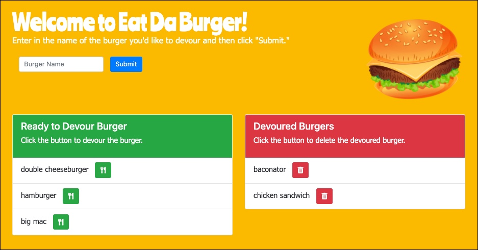

# Eat-Da-Burger

## Table of Contents
* [Description](#description)
* [Installation](#installation)
* [Technologies Used](#technologies-used)
* [Links and Screenshot](#links-and-screenshot)
* [License](#license)

## Description
A burger logger created with MySQL, Node, Express, Handlebars and a homemade ORM.

## Installation
To run the application locally, use the following command to clone this repository:    
`git clone https://github.com/MeganCarnaghi/Eat-Da-Burger.git`  

Once you're in the proper directory, run the following command in the Terminal to install the application depndencies:    
`npm install`  

Next, run the following command to start the application:    
`node server.js`  

Finally, navigate to http://localhost:3000/ in your browser.

## Technologies Used
* HTML
* CSS
* JQuery
* AJAX
* Node
* Express
* Handlebars
* ORM

## Links and Screenshot
* Link to GitHub Repository: https://github.com/MeganCarnaghi/Eat-Da-Burger.git
* Link to Heroku Page: https://still-hollows-01342.herokuapp.com/

## License

